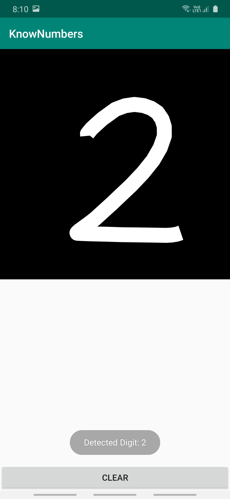
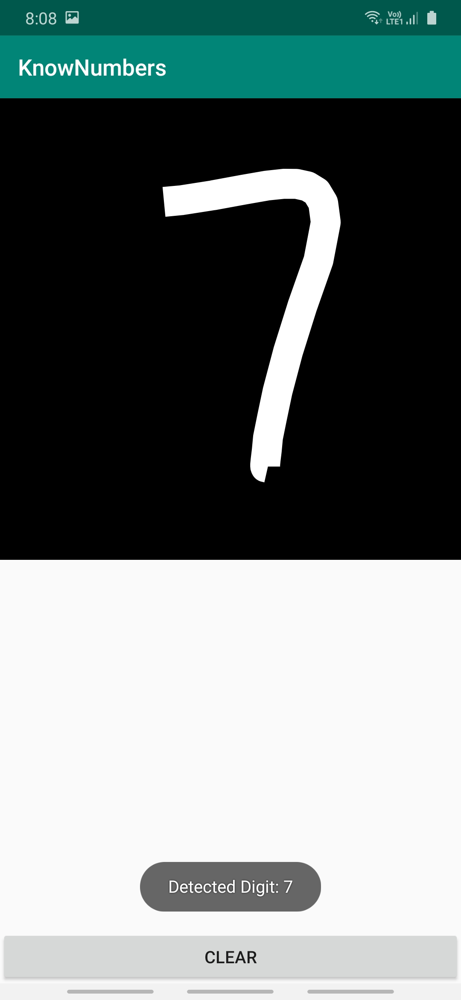
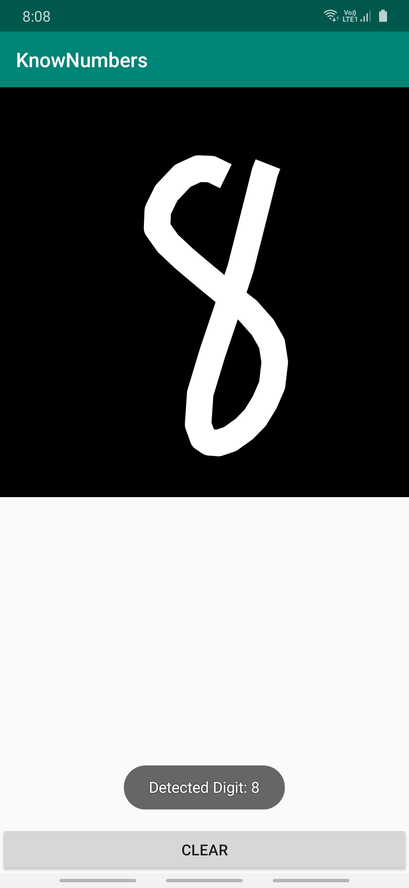

# Handritten Digit Recognition Using Tensorflow Lite on Android

### Overview
This is an android app for object detection using [TensorFlow Lite](https://www.tensorflow.org/lite) on a mobile device. I have trained my own model using the famous mnist dataset, and saved in .h5 format. Then I converted it to a tflite model for use in the app using this command:
`tflite_convert --output_file=mnist_model.tflite --keras_model_file=mnist_model.h5`  
The main problem with deployinmg machine learning models to mobile devices is the limited memory computation power. TensorFlow Lite is a lightweight package that solves these issues. [Here](https://drive.google.com/open?id=1531eT9V6kMDjfoEGjpjEGcfUUnBrQTCm) is a screen recording of the app.

### TensorFlow Lite Model
TensorFlow Lite is not designed to train a model, the model can be trained on a higher power device. Then, the pretrained model can be converted to a TensorFlow Lite format (.tflite), which has a smaller footprint than can be easily run on a mobile or other embedded devices for classification, regresion or other such tasks. The model (.tflite) file and the class labels (.txt) file need to be placed in the [assets](https://github.com/mrinalTheCoder/HandwrittenDigitsRecognition/tree/master/app/src/main/assets) folder of the android app.

### The Android App for Handritten Digits Recognition
In the app, there is a canvas on top where the user draws the digit. The app then invokes the digit recognition model. The output is given in the form of a toast. The digit recogniser is encapsulated by [DigitsClassifier](https://github.com/mrinalTheCoder/HandwrittenDigitsRecognition/blob/master/app/src/main/java/com/numbers/DigitsClassifier.java) which uses the [TensorFlow Lite Interpreter](https://www.tensorflow.org/lite/guide/inference#load_and_run_a_model_in_java).
`import org.tensorflow.lite.Interpreter`  

It is very easy to initialize the interpreter with the model:
`private Interpreter tflite; tfLite = new Interpreter(loadModelFile(assetManager));`  

The model is called by the below line, with a grayscale input of size 28x28:
`tfLite.run(byteBuffer, outputClasses);`  

### Results:
  Digit 2  

  Digit 7  

  Digit 8  

